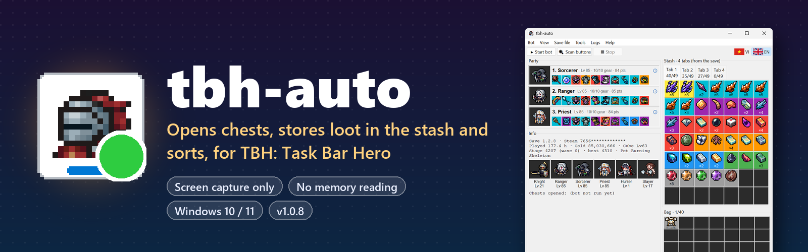
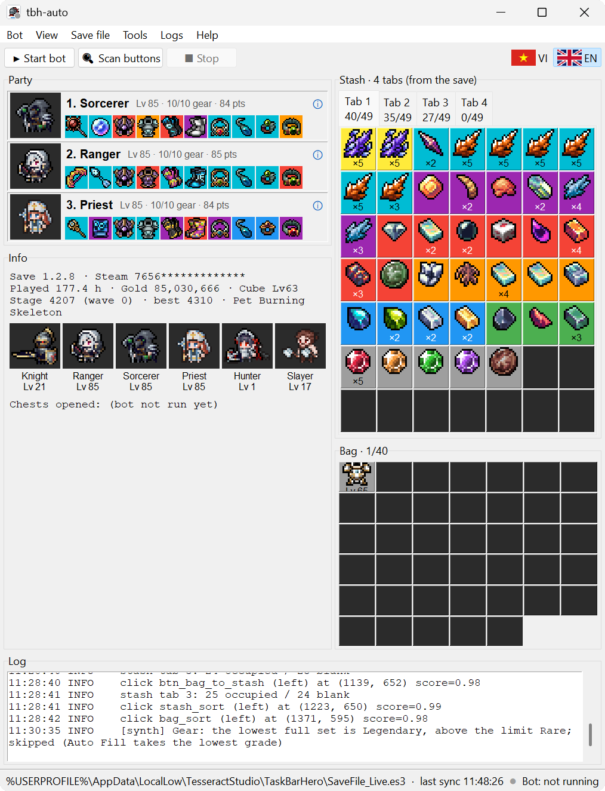
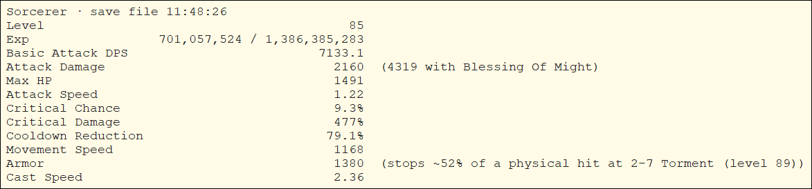
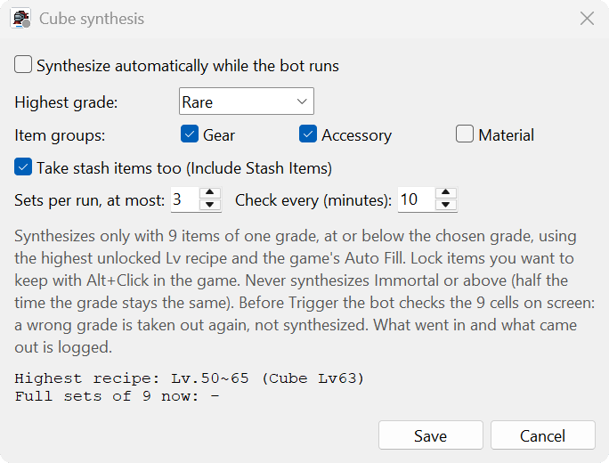

<p align="center">
  
</p>

<p align="center">
  <a href="https://github.com/levinhtxbt/tbh-auto/releases/download/v1.0.8/tbh-auto-setup-1.0.8.exe"></a>
  
  
  
  <a href="https://github.com/levinhtxbt/tbh-auto/issues"></a>
</p>

<p align="center">
   <b>English</b> &nbsp;·&nbsp; <a href="README.vi.md"> Tiếng Việt</a>
</p>

**tbh-auto** keeps *TBH: Task Bar Hero* tidy while you idle. It opens chests as they drop, moves the loot from your bag into the stash, and sorts both, so your bag never fills up.

It only **looks at the screen** and **clicks like a person**. It does not read game memory, inject code or touch the game's network traffic, and it only ever *reads* the save file. The only connection it makes is to GitHub, to check for a newer version, and you can turn that off.

<p align="center">
  <a href="https://github.com/levinhtxbt/tbh-auto/releases/download/v1.0.8/tbh-auto-setup-1.0.8.exe"></a>
  <br>
  <sub>~73 MB · Windows 10 / 11 64-bit (ARM too) · no Python, no admin rights · <a href="CHANGELOG.md">What's new</a> · <a href="https://github.com/levinhtxbt/tbh-auto/releases">Releases</a></sub>
</p>

> [!WARNING]
> The game's developer bans accounts that use "unauthorized programs": a permanent Steam Market ban, possibly a game ban. A bot that only reads the screen is harder to spot than one that reads memory, but it is still a grey area. **Use it at your own risk.**

## 📸 Screenshots

<table>
  <tr>
    <td width="50%" valign="top">
      
      <p align="center"><sub>Main window: party, info, stash tabs, bag and the bot's log</sub></p>
    </td>
    <td width="50%" valign="top">
      
      <p align="center"><sub><b>ⓘ</b> on a party card: the hero's stats, as in the in-game Stat window</sub></p>
      <br>
      
      <p align="center"><sub><b>Bot → Cube synthesis...</b></sub></p>
    </td>
  </tr>
</table>

## ✨ Features

| | Feature | What it does |
|:-:|---|---|
| 🎁 | **Opens chests** | Right-clicks every chest that shows up on the game's taskbar. If your account has the rune that opens all chests with Space, and the open-all option is on in the game, one Space press opens them all. |
| 📦 | **Stores the loot** | Clicks the button that moves the bag into the stash. When the open stash tab is full, it moves on to the next tab with room (up to 7 tabs). |
| 🔃 | **Sorts** | Sorts the stash and the bag. Every 3–5 minutes it stores and sorts even if no chest dropped. |
| ⚗️ | **Cube synthesis** | Combines 9 items of one grade into one item of a higher grade, up to the grade you allow. It never uses equipped items or items locked with **Alt+Click**, and never synthesizes Immortal or above. |
| 🖱️ | **Use your PC meanwhile** | Before each click it waits until you leave the mouse and keyboard alone for 0.5 s. Then it clicks and puts your cursor and focus back. The cursor is away for about 0.1 s. |
| 🔍 | **Any zoom, any language** | Detects the game's UI zoom (1x, 1.25x, 2x, 3x...) by itself and works whatever language the game is in. |
| 🖥️ | **Remote Desktop & VMs** | Keeps running after you close Remote Desktop. When the screen cannot be captured, *blind mode* clicks the spots it recorded earlier. |
| 📊 | **Save viewer** | Shows your party, hero stats, skills and gear, every stash tab, the bag, gold, stage and Cube level. Everything comes from the save file, and the item icons come from your installed game. |
| 🌐 | **English & Vietnamese** | One click switches the whole UI, including item and hero names. |
| 🐞 | **Built-in bug report** | Writes a bug report for you to post on GitHub or e-mail, with your Windows user name hidden. |
| 🔄 | **Updates itself** | Tells you when a new version is out and shows what changed. One click downloads it, checks its SHA256, installs it over your version and opens it again. |

## 🧭 Menus

**Toolbar:** **▶ Start bot** · **🔍 Scan buttons** · **■ Stop**, plus the **VI | EN** language switch at the top right.
**Status dot** (bottom right, and on the app icon): grey = not running · orange = preparing, scanning or waiting for the screen · green = running · red = error, see the log.

| Menu | Item | What it does |
|---|---|---|
| **Bot** | Start bot | Brings the game to the front, scans the buttons, then runs: chests → stash → sort. |
| | Scan buttons | Only the scan: finds the UI zoom and every button, and writes the result to the log. A missing button gets an orange warning. |
| | Stop | Stops after the current cycle. You can also stop the bot by moving the mouse into the top-left corner of the screen. |
| | Dry run (log only, no clicks) | Logs what the bot would click, without clicking. |
| | Blind mode (no screen capture) | Clicks the spots recorded by earlier scans and checks the result in the save file. Turns on by itself when the screen is lost. |
| | Put the cursor back after each click | On by default. Lets you keep using the PC while the bot runs. |
| | Show recorded spots (blind mode) | Lists the spots that blind mode will click. |
| | Cube synthesis... | Sets the highest grade, the item groups (Gear / Accessory / Material), whether to use stash items, sets per run and how often to run. Also shows what your save allows right now. |
| **View** | Party & info · Stash · Bag | Shows or hides each panel. |
| | Item names in cells | Shows item names inside the cells, which makes the window about twice as wide. Without it, cells show the icon with the count or level, like in the game. Click any cell for details. |
| **Save file** | Save file settings... | Sets the save file path (found automatically) and how often to check it. |
| | Reload now `F5` | Reads the save file again. |
| **Tools** | Get icons & names from the game | Reads item icons, hero portraits, names and the data tables for hero stats from your installed game. It only reads and changes nothing. Run it again after a game update. |
| | Remote Desktop › Keep the bot running when Remote Desktop closes | Asks for admin rights once. After that, closing Remote Desktop hands the session over to the PC's own screen, so the bot keeps going. |
| | Remote Desktop › Close Remote Desktop now, keep the bot running | Does the same handover right away. |
| **Logs** | Clear log · Open log file · Auto-scroll · Verbose (DEBUG) | Controls the log panel. The log is always in English. |
| **Help** | Report an issue... | Fills in a report with the versions, screen, bot state and the last 80 log lines. You then open a GitHub issue or send an e-mail yourself; nothing is sent automatically. |
| | Check for updates... | Asks GitHub for the latest version. If there is a newer one, shows what changed and offers **Update now**: download, check the SHA256, install over this version (keeping `config.yml` and your settings) and open the new version. |
| | Check for updates when the app starts | On by default. Checks at start-up, at most every 6 hours, and only speaks up when there is a new version. |
| | About... · Donate... | |

## 🚀 How to use

1. **Install.** Download [`tbh-auto-setup-1.0.8.exe`](https://github.com/levinhtxbt/tbh-auto/releases/download/v1.0.8/tbh-auto-setup-1.0.8.exe) and run it.
   - If SmartScreen says *Windows protected your PC*, click **More info → Run anyway**. The exe is not code-signed.
   - Keep the default install folder, or pick one like `C:\tbh-auto`. Program Files is not allowed.
   - Tick **Get item icons & hero names from the installed game**.
2. **Open the game windows.** In the game, open the **Stash** window, and the **Hero** window on its **Bag** tab. Both must be visible on screen.
3. **Scan.** Open tbh-auto and click **🔍 Scan buttons**. The log shows the UI zoom and every button found. If a line is orange, the window it needs is usually closed or covered.
4. **Run.** Click **▶ Start bot**; the status dot turns green. To stop, click **■ Stop** or move the mouse into the top-left corner of the screen.

**To update**, click **Update now** when tbh-auto says a new version is out, or use **Help → Check for updates...**. You can also run a newer installer over the old one yourself. Either way `config.yml` and your settings are kept. **To uninstall**, go to *Settings → Apps → Installed apps → tbh-auto*. Advanced settings (delays, the Hero window hotkey, turning features on or off) are in `config.yml` in the install folder, and every line in it is commented.

> [!NOTE]
> On a PC with **Smart App Control** turned on (common on fresh Windows 11 installs), Windows blocks unsigned programs outright: *"An Application Control policy has blocked this file"*. There is no Run anyway button in that case.

<details>
<summary>Check the download (SHA256)</summary>

```powershell
Get-FileHash .\tbh-auto-setup-1.0.8.exe -Algorithm SHA256
# 6af5152c033ba475c83fd0720ce1a8a78a7ef36131eb01fb054786ed73a173f0
```

</details>

## 💬 Feedback & support

- 🐞 **Found a bug or have an idea?** Use **Help → Report an issue...** in the app, or [open an issue](https://github.com/levinhtxbt/tbh-auto/issues).
- ☕ **Like it?** [Buy me a coffee](https://buymeacoffee.com/levinhtxbt).
- 📝 **What changed:** see the [changelog](CHANGELOG.md).

<p align="center">
  
  <br>
  <sub>Made by Vinh Le · not affiliated with the developer of TBH: Task Bar Hero</sub>
</p>
