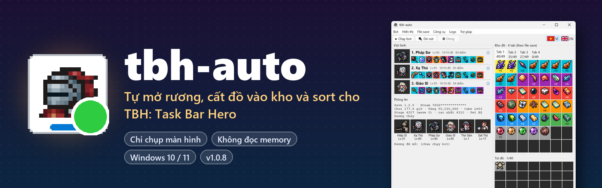
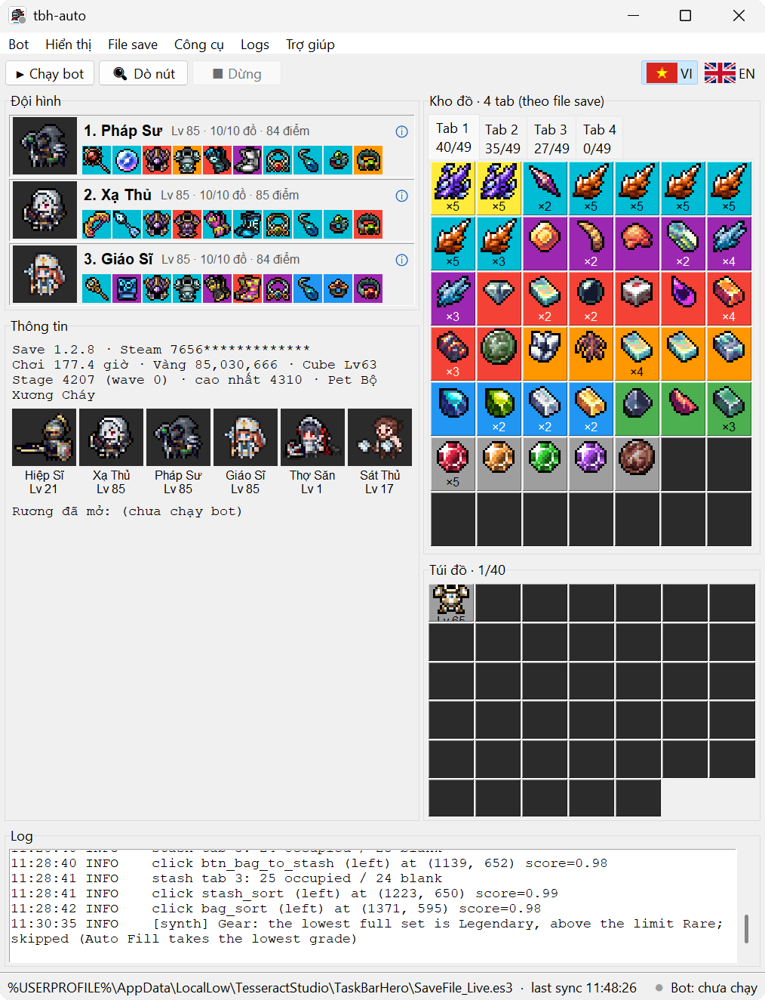
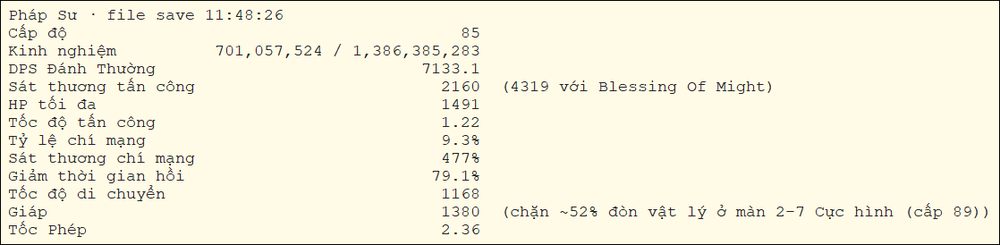
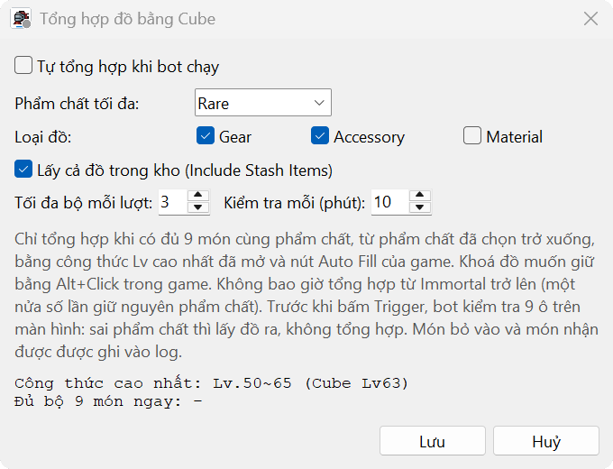
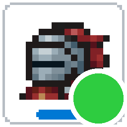

<p align="center">
  
</p>

<p align="center">
  <a href="https://github.com/levinhtxbt/tbh-auto/releases/download/v1.0.8/tbh-auto-setup-1.0.8.exe"></a>
  
  
  
  <a href="https://github.com/levinhtxbt/tbh-auto/issues"></a>
</p>

<p align="center">
  <a href="README.md"> English</a> &nbsp;·&nbsp;  <b>Tiếng Việt</b>
</p>

**tbh-auto** giữ cho *TBH: Task Bar Hero* luôn gọn gàng khi bạn treo máy. Tool tự mở rương khi rơi ra, chuyển đồ từ túi vào kho rồi sort cả hai, để túi không bao giờ bị đầy.

Tool chỉ **nhìn màn hình** và **bấm chuột như người**. Tool không đọc memory, không inject vào game, không đụng network của game, và chỉ *đọc* file save, không bao giờ ghi. Kết nối duy nhất tool tạo ra là tới GitHub để kiểm tra bản mới, và bạn có thể tắt nó.

<p align="center">
  <a href="https://github.com/levinhtxbt/tbh-auto/releases/download/v1.0.8/tbh-auto-setup-1.0.8.exe"></a>
  <br>
  <sub>~73 MB · Windows 10 / 11 64-bit (cả máy ARM) · không cần Python, không cần quyền admin · <a href="CHANGELOG.md">Có gì mới</a> · <a href="https://github.com/levinhtxbt/tbh-auto/releases">Releases</a></sub>
</p>

> [!WARNING]
> Nhà phát triển game phạt rất nặng tài khoản dùng "chương trình trái phép": khoá Steam Market vĩnh viễn, có thể khoá cả game. Bot chỉ nhìn màn hình khó bị phát hiện hơn bot đọc memory, nhưng vẫn là vùng xám. **Dùng là tự chịu rủi ro.**

## 📸 Hình ảnh

<table>
  <tr>
    <td width="50%" valign="top">
      
      <p align="center"><sub>Cửa sổ chính: đội hình, thông tin, các tab kho, túi đồ và log của bot</sub></p>
    </td>
    <td width="50%" valign="top">
      
      <p align="center"><sub><b>ⓘ</b> trên thẻ hero: bảng chỉ số giống bảng Stat trong game</sub></p>
      <br>
      
      <p align="center"><sub><b>Bot → Tổng hợp đồ (Cube)...</b></sub></p>
    </td>
  </tr>
</table>

## ✨ Tính năng

| | Tính năng | Chi tiết |
|:-:|---|---|
| 🎁 | **Mở rương** | Chuột phải vào mọi rương hiện trên thanh taskbar của game. Nếu account đã học rune *Nhấn Space mở tất cả loại rương cùng lúc* và bật *Mở tất cả hộp hàng loạt* trong game, bot chỉ cần bấm Space một lần là mở hết. |
| 📦 | **Cất đồ vào kho** | Bấm nút **Kho đồ < Túi đồ**. Tab kho đang mở đầy thì bot tự chuyển sang tab còn chỗ (tối đa 7 tab). |
| 🔃 | **Sort** | Sort kho và túi. Cứ 3–5 phút bot cất đồ và sort một lần, kể cả khi không có rương. |
| ⚗️ | **Tổng hợp bằng Cube** | Gộp 9 món cùng phẩm chất thành 1 món phẩm chất cao hơn, trong giới hạn bạn chọn. Bot không bao giờ dùng đồ đang mặc hay đồ đã khoá bằng **Alt+Click**, và không bao giờ tổng hợp từ Immortal trở lên. |
| 🖱️ | **Vẫn dùng máy được** | Trước mỗi click, bot chờ bạn ngừng dùng chuột / bàn phím 0,5 giây. Click xong, bot trả chuột và focus về chỗ cũ. Chuột chỉ rời chỗ khoảng 0,1 giây. |
| 🔍 | **Mọi mức zoom, mọi ngôn ngữ** | Tự nhận ra mức zoom UI của game (1x, 1.25x, 2x, 3x...), và game để ngôn ngữ nào cũng chạy. |
| 🖥️ | **Remote Desktop & máy ảo** | Bot vẫn chạy sau khi đóng Remote Desktop. Khi không chụp được màn hình, *chế độ mù* bấm theo các vị trí đã ghi trước đó. |
| 📊 | **Xem file save** | Xem đội hình, chỉ số hero, kỹ năng, đồ đang mặc, từng tab kho, túi, vàng, stage, cấp Cube. Mọi thứ đọc từ file save; icon đồ lấy từ game đã cài trên máy bạn. |
| 🌐 | **Tiếng Việt & English** | Một click đổi cả giao diện, kể cả tên đồ và tên hero. |
| 🐞 | **Báo lỗi có sẵn** | Soạn sẵn báo cáo lỗi để bạn gửi lên GitHub hoặc qua email; tên user Windows được ẩn. |
| 🔄 | **Tự cập nhật** | Báo khi có bản mới và cho xem có gì thay đổi. Một click là tool tải về, kiểm tra SHA256, cài đè lên bản đang dùng rồi tự mở lại. |

## 🧭 Các menu

**Thanh công cụ:** **▶ Chạy bot** · **🔍 Dò nút** · **■ Dừng**, cùng nút đổi ngôn ngữ **VI | EN** ở góc trên bên phải.
**Chấm trạng thái** (góc dưới bên phải và trên icon app): xám = chưa chạy · cam = đang chuẩn bị, đang dò nút hoặc chờ màn hình · xanh = đang chạy · đỏ = lỗi, xem log.

| Menu | Mục | Công dụng |
|---|---|---|
| **Bot** | Chạy bot | Đưa game lên trên, dò nút, rồi chạy vòng lặp: mở rương → cất kho → sort. |
| | Dò nút | Chỉ dò: tìm mức zoom UI và từng nút, rồi ghi kết quả ra log. Nút nào không thấy sẽ có cảnh báo màu cam. |
| | Dừng | Dừng sau chu kỳ đang chạy. Kéo chuột vào góc trên bên trái màn hình cũng dừng bot. |
| | Dry-run (chỉ log, không bấm) | Ghi log những gì bot định bấm mà không bấm thật. |
| | Chế độ mù (không chụp màn hình) | Bấm theo vị trí đã ghi từ các lần dò nút trước, rồi đọc file save để kiểm tra kết quả. Tự bật khi mất màn hình. |
| | Trả chuột về chỗ cũ sau mỗi click | Mặc định bật, để bạn vẫn dùng máy được trong lúc bot chạy. |
| | Xem vị trí đã ghi (chế độ mù) | Liệt kê các vị trí mà chế độ mù sẽ bấm. |
| | Tổng hợp đồ (Cube)... | Chọn phẩm chất tối đa, loại đồ (Gear / Accessory / Material), có lấy đồ trong kho không, số bộ mỗi lượt và bao lâu chạy một lượt. Hộp thoại cũng cho xem file save hiện đủ cho bao nhiêu bộ. |
| **Hiển thị** | Đội hình & thông tin · Kho đồ · Túi đồ | Ẩn hoặc hiện từng khung. |
| | Tên đồ trong ô | Hiện tên đồ ngay trong ô, khi đó cửa sổ rộng gần gấp đôi. Nếu tắt, mỗi ô chỉ hiện icon kèm số lượng hoặc cấp, giống trong game. Click vào ô để xem chi tiết. |
| **File save** | Cài đặt file save... | Đặt đường dẫn file save (tool tự tìm) và chu kỳ kiểm tra. |
| | Đọc lại ngay `F5` | Đọc lại file save. |
| **Công cụ** | Lấy icon & tên từ game | Đọc icon đồ, chân dung hero, tên và các bảng dữ liệu để tính chỉ số hero từ game đã cài. Chỉ đọc, không sửa gì. Nên chạy lại sau mỗi lần game cập nhật. |
| | Remote Desktop › Giữ bot chạy khi đóng Remote Desktop | Hỏi quyền admin một lần. Từ đó mỗi khi bạn đóng Remote Desktop, phiên được chuyển sang màn hình của máy, nên bot vẫn chạy tiếp. |
| | Remote Desktop › Đóng Remote Desktop ngay, bot vẫn chạy | Chuyển phiên như trên, nhưng làm ngay lập tức. |
| **Logs** | Xoá log · Mở file log · Tự cuộn · Chi tiết (DEBUG) | Các tuỳ chọn cho khung log. Log luôn bằng tiếng Anh. |
| **Trợ giúp** | Báo lỗi / góp ý... | Điền sẵn báo cáo gồm phiên bản, màn hình, trạng thái bot và 80 dòng log cuối. Sau đó bạn tự mở issue GitHub hoặc gửi email; app không tự gửi gì. |
| | Kiểm tra cập nhật... | Hỏi GitHub bản mới nhất. Nếu có bản mới hơn thì cho xem có gì thay đổi và nút **Cập nhật ngay**: tải về, kiểm tra SHA256, cài đè lên bản này (giữ `config.yml` và các cài đặt) rồi mở bản mới. |
| | Tự kiểm tra cập nhật khi mở app | Mặc định bật. Kiểm tra lúc mở app, tối đa 6 tiếng một lần, và chỉ lên tiếng khi có bản mới. |
| | Giới thiệu... · Ủng hộ (Donate)... | |

## 🚀 Cách sử dụng

1. **Cài đặt.** Tải [`tbh-auto-setup-1.0.8.exe`](https://github.com/levinhtxbt/tbh-auto/releases/download/v1.0.8/tbh-auto-setup-1.0.8.exe) rồi chạy.
   - Nếu SmartScreen hiện *Windows protected your PC*, bấm **More info → Run anyway**. Exe chưa được ký số.
   - Giữ thư mục cài mặc định, hoặc chọn thư mục khác như `C:\tbh-auto`. Không chọn được Program Files.
   - Tick **Get item icons & hero names from the installed game**.
2. **Mở cửa sổ trong game.** Mở cửa sổ **Kho đồ**, và cửa sổ **Hero** ở tab **Túi đồ**. Cả hai phải cùng hiện trên màn hình.
3. **Dò nút.** Mở tbh-auto, bấm **🔍 Dò nút**. Log ghi mức zoom UI và từng nút tìm được. Dòng nào màu cam thường là do cửa sổ cần dùng đang đóng hoặc bị che.
4. **Chạy.** Bấm **▶ Chạy bot**, chấm trạng thái chuyển xanh. Muốn dừng thì bấm **■ Dừng**, hoặc kéo chuột vào góc trên bên trái màn hình.

**Cập nhật**: bấm **Cập nhật ngay** khi tbh-auto báo có bản mới, hoặc vào **Trợ giúp → Kiểm tra cập nhật...**. Bạn cũng có thể tự chạy bộ cài bản mới đè lên bản cũ. Cách nào thì `config.yml` và các cài đặt cũng được giữ nguyên. **Gỡ cài đặt**: vào *Settings → Apps → Installed apps → tbh-auto*. Cài đặt nâng cao (delay, phím mở cửa sổ Hero, bật / tắt từng tính năng) nằm trong `config.yml` ở thư mục cài, mỗi dòng đều có chú thích.

> [!NOTE]
> Trên máy bật **Smart App Control** (thường gặp ở Windows 11 mới cài), Windows chặn hẳn chương trình chưa ký số: *"An Application Control policy has blocked this file"*. Khi đó không có nút Run anyway.

<details>
<summary>Kiểm tra file tải về (SHA256)</summary>

```powershell
Get-FileHash .\tbh-auto-setup-1.0.8.exe -Algorithm SHA256
# 6af5152c033ba475c83fd0720ce1a8a78a7ef36131eb01fb054786ed73a173f0
```

</details>

## 💬 Góp ý & ủng hộ

- 🐞 **Gặp lỗi hay có ý tưởng?** Vào **Trợ giúp → Báo lỗi / góp ý...** trong app, hoặc [mở issue](https://github.com/levinhtxbt/tbh-auto/issues).
- ☕ **Thấy tool có ích?** [Mời tác giả một ly cà phê](https://buymeacoffee.com/levinhtxbt).
- 📝 **Có gì thay đổi:** xem [lịch sử phiên bản](CHANGELOG.md).

<p align="center">
  
  <br>
  <sub>Tác giả: Vinh Le · không liên quan tới nhà phát triển TBH: Task Bar Hero</sub>
</p>
